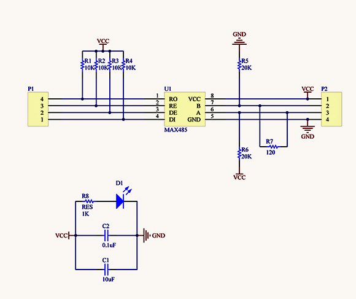

# RS485-Testing-with-STM32

# Contents

* [Introduction](#introduction)
* [Tools](#tools)
* [Implementation](#implementation)
* [Acknowledgement](#cknowledgement)


## Introduction

 RS-485 is a multipoint communications standard set by the Electronics Industry Alliance (EIA) and Telecommunications Industry Association (TIA). RS-485 supports several connection types, including DB-9 and DB-37. Because of lower impedance receivers and drivers, RS-485 supports more nodes per line than RS-422. RS-485 is also known as EIA-485 or TIA-485.

## Tools

### [STM32-Nucleo Development Boards](https://www.st.com/en/evaluation-tools/stm32-nucleo-boards.html#:~:text=The%20highly%20affordable%20STM32%20Nucleo,prototypes%20with%20any%20STM32%20MCU.&text=The%20STM32%20Nucleo%20boards%20integrate,need%20for%20a%20separate%20probe.)
STM32 is a family of 32-bit microcontroller integrated circuits by STMicroelectronics. The STM32 chips are grouped into related series that are based around the same 32-bit ARM processor core, such as the Cortex-M33F, Cortex-M7F, Cortex-M4F, Cortex-M3, Cortex-M0+, or Cortex-M0. Internally, each microcontroller consists of the processor core, static RAM, flash memory, debugging interface, and various peripherals.

### [Atollic TrueSTUDIO](https://atollic.com/truestudio/)

Atollic® TrueSTUDIO® for STM32 is a flexible and extensible development and debugging IDE for STM32 MCU developers who want extremely powerful tools to aid in development of high-quality embedded software. TrueSTUDIO® is based on open standards (ECLIPSE and GNU) and extended with professional features for code management and advanced system analysis. This gives a unique insight into the structure and the dynamic behavior of the system.

### [RS485 Modules](https://www.digikey.com/catalog/en/partgroup/rs-485-transceivers/10428)



## Implementation

This is custom implementation of RS485 communication on my opinion. If you take advantage of this development , i recomend to go through the RS485 communication fundamentals, C++ programmimg fundamentals strongly & about STM32 MCUs properly. This implementation is highly depends on them. 

### Architecture


### Custom DataFrame Format


* SYNC - The synchronisation Byte
* M toS - Master to Slave
* S to M - Slave to Master
* ADDR - Slave address
* D1...D4 - Data fields
* STATUS - Valid reading or Invalid reading 
* CRC - Cyclic Redundancy Check (Polynomial will be designers choice)
* EMPTY - Not assigned a value yet, it can be designers choice, default value is 0.

### State Diagrame of Master


### State Diagrame of Slaves


### Flow

* master sends a request data frame to all of the slaves.
* Slaves identify the data frame and and send the appropriate data to the Master.
* All the slaves and Master, filter the received data according to their different fields of the data frame. 
* We can introduce RS 485 as extended UART, the main advantage is, it is a bus network and the data can be transmitted over long distances with high immunity to noise.
* In this architecture, there should be one sender at a time, all others should be receivers. 
* If not, the bus will not function correctly.
* Use suitable UART peripheral you want & update it on rs485_XXXXX_configure.h file


### Warning

```diff
- Above state diagrams are not exactly the same with the codes, because there are some modifications  with developing the code. Analize C codes carefully and understand the state diagram modifications, what initially did. (Above state diagrams are what should exactly do, they are the simplest ones)
```


